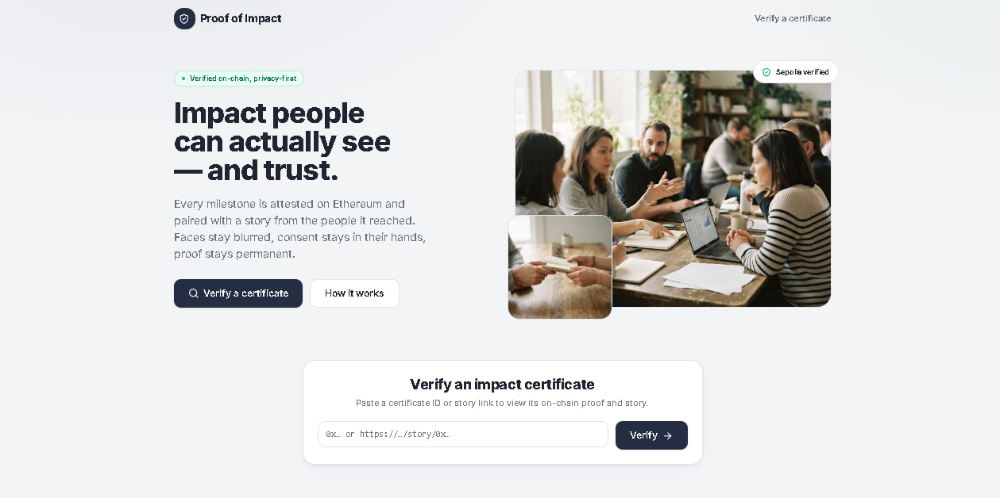
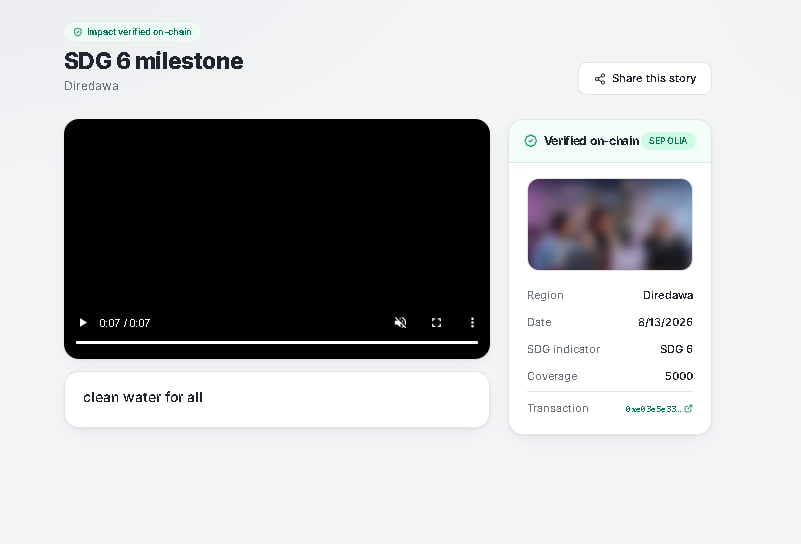
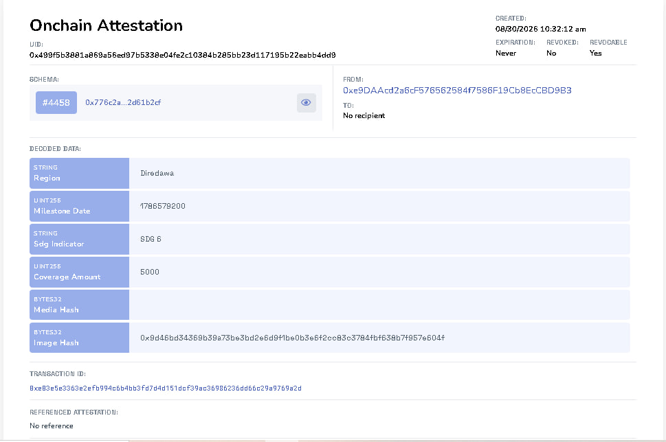
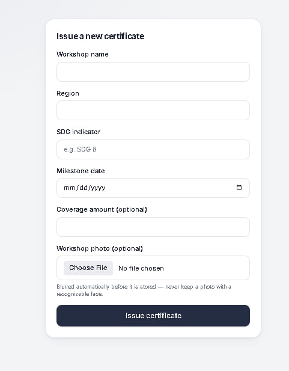
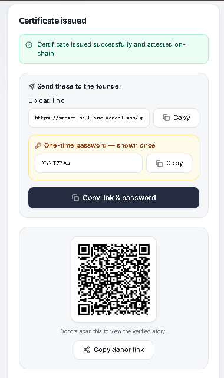
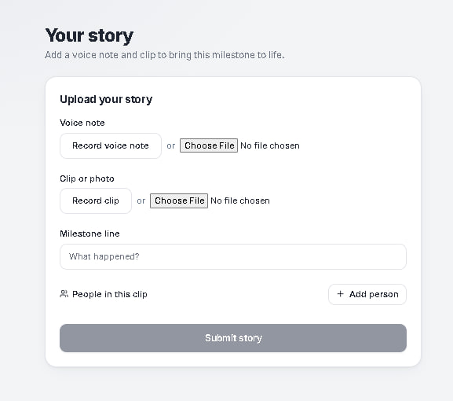

# Proof of Impact

**Verifiable impact certificates that people can see — without exposing the people in them.**

Proof of Impact lets an organization issue tamper-proof, on-chain certificates for real-world milestones (workshops, training, community programs), attach a human story (a voice note or short video) to each one, and share a public verification page — while giving the people featured in those stories full, revocable control over whether they appear publicly.

The result is a page a donor can scan, read, and trust: the milestone is cryptographically attested on Ethereum (Sepolia), the media is real, and every visible face or name is there by explicit consent.

---

## Screenshots

### Landing page

The public entry point. Visitors can paste a certificate ID or story link to verify any milestone, and see how the on-chain, privacy-first model works.



### Public verification page (donor-facing)

The page a donor lands on after scanning the QR code: the human story (voice/video), its caption, and a cryptographic "Verified on-chain" panel with the blurred workshop photo, milestone metadata, and a link to the live Sepolia attestation.



### On-chain attestation (EAS, Sepolia)

Every certificate is a real [Ethereum Attestation Service](https://attest.org) attestation on Sepolia — independently verifiable on the public explorer. The decoded data carries the region, milestone date, SDG indicator, coverage, and the media/image hashes; no personal data is ever written on-chain.



### Admin — issue a certificate

The operator console for minting a new on-chain certificate. The optional workshop photo is blurred automatically before storage so no recognizable face is ever kept.



### Admin — hand off to the founder

After issuing, the operator gets a private upload link and a one-time password to send to the founder (copied together with one button), plus a separate QR code that donors scan to view the verified story.



### Founder — upload a story

The per-certificate, password-protected workspace where a founder records or uploads a voice note and clip, adds a milestone line, and tags the people featured — setting each person's public/private consent.



---

## Table of contents

- [Screenshots](#screenshots)
- [The problem](#the-problem)
- [How it works](#how-it-works)
- [Roles](#roles)
- [Architecture](#architecture)
- [Tech stack](#tech-stack)
- [Data model](#data-model)
- [The on-chain / off-chain firewall](#the-on-chain--off-chain-firewall)
- [Consent model](#consent-model)
- [API reference](#api-reference)
- [Project structure](#project-structure)
- [Environment variables](#environment-variables)
- [Local development](#local-development)
- [Deployment](#deployment)
- [Design system](#design-system)

---

## The problem

Impact reporting forces a bad trade-off. Numbers alone ("we trained 500 people") are easy to fabricate and impossible to feel. Real stories — a voice, a face, a name — are trustworthy and moving, but publishing them exposes vulnerable people to risk without meaningful consent, and the underlying claim still isn't verifiable.

Proof of Impact separates the two concerns:

- **The claim is made verifiable** by anchoring it as an [Ethereum Attestation Service](https://attest.org) (EAS) attestation on-chain — anyone can independently confirm it on a public explorer.
- **The human story is made safe** by keeping all media off-chain and gating every person behind explicit, revocable consent. Only the *hash* of the media is mirrored on-chain, never the media itself.

---

## How it works

1. **Issue.** An administrator issues a certificate for a milestone (region, SDG indicator, milestone date, optional coverage amount, and an optional blurred workshop photo). The backend writes an EAS attestation to Sepolia and stores off-chain metadata in PostgreSQL. The attestation UID becomes the certificate's permanent ID.
2. **Hand off.** The admin receives a **founder upload link + one-time password** (to give to the workshop founder) and a separate **donor QR code** that points to the public verification page.
3. **Add the story.** The founder logs in with the password and uploads a voice note or short clip, adds the people involved, and sets each person's consent to public or private.
4. **Verify & share.** Anyone with the link or QR code opens the public story page: the on-chain attestation is displayed and independently verifiable, alongside the story media and **only the people who consented to appear**.
5. **Revoke anytime.** From the founder dashboard, consent can be toggled per person; the public page reflects the change on the next load, with no trace of anyone who was removed.

---

## Roles

| Role | Authenticates with | Can |
|------|-------------------|-----|
| **Admin** | A shared `ADMIN_TOKEN` (bearer) | Issue certificates and write attestations on-chain |
| **Founder** | A per-certificate password → JWT | Upload a story, manage people, toggle consent, delete a story |
| **Donor / public** | Nothing (public read) | View a verified story page with consent-filtered people |

---

## Architecture

Proof of Impact is a two-part application deployed as two independent services:

```
                          ┌─────────────────────────────┐
                          │        Ethereum (Sepolia)     │
                          │   EAS attestation + registry  │
                          └──────────────▲──────────────┘
                                         │ chain.service.ts (sole gateway)
                                         │
┌──────────────┐   HTTPS/JSON   ┌────────┴─────────┐   SQL   ┌──────────────┐
│  React SPA   │◀──────────────▶│  Express / TS API │◀───────▶│  PostgreSQL   │
│ (Vite, Vercel)│   /api/v1     │      (Render)     │  Prisma │ proof_of_impact│
└──────────────┘                └────────┬─────────┘         └──────────────┘
                                         │
                                  ┌──────┴───────┐
                                  │  Cloudinary   │  blurred certificate images
                                  │  local/disk   │  story media (voice / clip)
                                  └──────────────┘
```

- The **frontend** is a static single-page app. In production it talks to the backend over an absolute API URL (`VITE_API_BASE_URL`); in local dev Vite proxies `/api` and `/uploads` to the backend.
- The **backend** is a long-running Express server (not serverless — it holds a persistent process and file handles), which is why it is deployed to a persistent host such as Render rather than to a serverless function.
- **All blockchain access is funnelled through a single module** (`chain.service.ts`) so the on-chain/off-chain boundary is enforceable by inspection, not convention.

---

## Tech stack

**Backend**
- Node.js + TypeScript, Express
- Prisma ORM against PostgreSQL (multi-schema, pinned to a dedicated `proof_of_impact` schema)
- Ethereum Attestation Service SDK + `ethers` for on-chain attestations on Sepolia
- Cloudinary for blurred certificate images; local disk (or a mounted volume) for story media
- Zod for request validation, JWT for founder sessions, bcrypt-hashed founder passwords
- `fluent-ffmpeg` for the media generation pipeline

**Frontend**
- React + TypeScript, Vite
- React Router (client-side routing with SPA rewrite)
- Tailwind CSS design system with the Inter typeface and `lucide-react` icons
- SWR-style hooks over a shared Axios client
- `qrcode.react` for donor QR codes

---

## Data model

All tables live in a dedicated `proof_of_impact` PostgreSQL schema so the app never touches unrelated data in the database's `public` schema.

- **Founder** — a workshop owner. Holds a bcrypt `passwordHash` and owns many certificates.
- **Certificate** — one issued milestone. Its `id` **is** the EAS attestation UID (set explicitly at creation, never DB-generated). Stores `sdgIndicator`, `milestoneDate`, optional `coverageAmount`, `txHash`, `chainNetwork`, plus off-chain `certificateImageUrl` (Cloudinary) and its `imageHash` (mirrored on-chain).
- **StoryMedia** — the story attached to a certificate: `voiceUrl`, `clipUrl`, `milestoneText`, and an optional generated clip/page. One per certificate.
- **Person** — someone featured in a story. `consentPublic` is a required boolean **with no default** — it must be set explicitly on every insert, enforced again in Zod and in the service layer. Deleting a story cascades to its people.

---

## The on-chain / off-chain firewall

This is the central design guarantee of the project:

- **`backend/src/services/chain.service.ts` is the only file permitted to talk to the blockchain.** The on-chain read needed to assemble a public story view is deliberately split into its own module (`storyView.service.ts`), so `story.service.ts` (which purges media) has zero blockchain imports. The boundary is verifiable by grepping imports.
- **No personal media ever goes on-chain.** The attestation carries only structured milestone fields and content *hashes* (`mediaHash`, `imageHash`). The media itself lives on Cloudinary / disk and is fully deletable off-chain.
- **EAS config is centralized and self-healing.** `eas.config.ts` resolves the EAS contract and schema-registry addresses from env vars, and falls back to the canonical Sepolia deployment addresses (with a loud warning) if an env value is missing or malformed — so a truncated address can't silently attest against the wrong contract.

The registered EAS schema is:

```
string region, uint256 milestoneDate, string sdgIndicator, uint256 coverageAmount, bytes32 mediaHash, bytes32 imageHash
```

Changing any field means a **new immutable schema** — re-register with `npm run eas:register-schema` and set the new `EAS_SCHEMA_UID`.

---

## Consent model

- `Person.consentPublic` has **no default** anywhere in the stack (database, validation, or UI). A missing value is a validation error, so no one is ever public by accident.
- The **public** story endpoint (`GET /story/:id`) filters people fresh on every request and returns **only** those currently set to public — with no hint that anyone else exists.
- A separate **founder-scoped** endpoint (`GET /certificates/:id/people`) returns the full roster including private people, so the dashboard can toggle consent in either direction. This is why revocation is fully reversible: the founder always sees everyone, the public only ever sees consenters.

---

## API reference

Base path: `/api/v1`

| Method | Endpoint | Auth | Purpose |
|--------|----------|------|---------|
| `POST` | `/admin/certificates` | Admin token | Issue a certificate (optional `image` multipart field), write the EAS attestation, return the founder link + one-time password + donor QR URL |
| `POST` | `/auth/founder-login` | — | Exchange a certificate password for a founder JWT |
| `POST` | `/certificates/:id/story` | Founder JWT | Upload a story (`voice` + `clip` multipart fields), people, and per-person consent |
| `GET` | `/story/:id` | — (public) | Fetch the consent-filtered public story + on-chain verification data |
| `GET` | `/certificates/:id/people` | Founder JWT | Fetch the full roster (including private) for consent management |
| `PATCH` | `/certificates/:id/consent` | Founder JWT | Update per-person consent |
| `DELETE` | `/certificates/:id/story` | Founder JWT | Delete a story and purge its off-chain media |

Uploads are handled with `multer` in-memory: 15 MB limit for certificate images, 50 MB for story media.

---

## Project structure

```
.
├── backend/                     # Express + TypeScript API (deploy to a persistent host)
│   ├── prisma/schema.prisma     # multi-schema Postgres data model
│   ├── scripts/registerSchema.ts# one-time EAS schema registration
│   └── src/
│       ├── app.ts               # Express app (exports the app instance)
│       ├── server.ts            # entrypoint — app.listen(PORT)
│       ├── config/              # cloudinary + EAS/Sepolia config
│       ├── controllers/         # admin, auth, consent, story
│       ├── middlewares/         # admin auth, founder auth, error handler
│       ├── routes/              # /admin, /auth, /consent, /story
│       ├── schemas/             # Zod request validation
│       ├── services/            # chain (sole chain gateway), story, storyView,
│       │                        #   image, storage, generator, auth
│       └── utils/               # ApiError, ApiResponse, asyncHandler, jwt, prisma
│
└── frontend/                    # React + Vite SPA (deploy to Vercel)
    ├── vercel.json              # SPA rewrite so deep links / QR scans resolve
    └── src/
        ├── main.tsx             # routes
        ├── pages/               # home, admin/issue, founder/login, founder/dashboard, story
        ├── components/ui/       # Button, Card, Input, Alert, Badge, Switch, Dialog, Tabs
        ├── components/common/   # CertificatePanel, ShareButton, QRCodeDisplay,
        │                        #   VideoPlayer, recorders, PersonConsentRow
        ├── hooks/               # data hooks (story, login, upload, consent, ...)
        └── lib/                 # axios client + media URL resolver, founder token
```

---

## Environment variables

**Backend**

| Variable | Description |
|----------|-------------|
| `DATABASE_URL` | PostgreSQL connection string |
| `PORT` | Port the server listens on |
| `SEPOLIA_RPC_URL` | Sepolia JSON-RPC endpoint (e.g. Alchemy / Infura) |
| `SIGNER_PRIVATE_KEY` | Private key of a funded Sepolia wallet that signs attestations |
| `EAS_SCHEMA_UID` | UID of the registered EAS schema |
| `EAS_CONTRACT_ADDRESS` | EAS contract (falls back to canonical Sepolia address if unset/invalid) |
| `EAS_SCHEMA_REGISTRY_ADDRESS` | Schema registry (same fallback behavior) |
| `ADMIN_TOKEN` | Shared bearer token authorizing certificate issuance |
| `JWT_SECRET` / `JWT_EXPIRES_IN_SECONDS` | Founder session signing + lifetime |
| `CLOUDINARY_CLOUD_NAME` / `CLOUDINARY_API_KEY` / `CLOUDINARY_API_SECRET` | Certificate image hosting |
| `STORAGE_LOCAL_DIR` | Directory for story media (see the deployment note on persistence) |
| `PUBLIC_APP_BASE_URL` | Public frontend base URL used to build QR / share links |

**Frontend**

| Variable | Description |
|----------|-------------|
| `VITE_API_BASE_URL` | Absolute backend API URL (e.g. `https://your-backend.onrender.com/api/v1`). Falls back to a relative `/api/v1` for local one-domain dev. |

---

## Local development

**Prerequisites:** Node.js, a PostgreSQL instance, `ffmpeg` on your `PATH`, a Sepolia RPC URL, and a funded Sepolia wallet.

**Backend**

```bash
cd backend
cp .env.example .env            # fill in the variables above
npm install
npx prisma migrate dev --name init
npm run eas:register-schema     # one-time; paste the printed UID into EAS_SCHEMA_UID
npm run dev
```

**Frontend**

```bash
cd frontend
npm install
npm run dev
```

In dev, Vite proxies `/api` and `/uploads` to the backend, so no frontend env file is needed for a single-machine setup.

---

## Deployment

The two services deploy independently.

### Backend → a persistent host (e.g. Render)

The backend is a long-running Express server, so it needs a persistent runtime — **not** a serverless function.

- **Build command:** `npm install && npm run build`
  (runs `prisma generate` then compiles TypeScript with the project's pinned compiler)
- **Start command:** `npm start` → `node dist/src/server.js`
- Set **all backend environment variables** on the service.
- Do **not** set `NODE_ENV=production` at build time, or `npm install` will skip the dev dependencies (TypeScript, Prisma CLI, types) the build needs.

> **Story media persistence:** `STORAGE_LOCAL_DIR` uses the local filesystem, which is wiped on every redeploy on ephemeral hosts. For durable story media, attach a persistent disk or move storage to a cloud provider (the `storage.service.ts` interface is designed to swap). Certificate images are already durable on Cloudinary.

### Frontend → Vercel

- **Root directory:** `frontend` (critical — otherwise Vercel tries to build the backend as a serverless function and crashes)
- **Framework preset:** Vite → build `npm run build`, output `dist`
- Set `VITE_API_BASE_URL` to the deployed backend URL.
- `vercel.json` rewrites all routes to `index.html`, so QR deep links like `/story/:id` resolve correctly on a fresh load.

After deploying, set the backend's `PUBLIC_APP_BASE_URL` to the **frontend** domain so generated QR codes and share links point at the public story pages.

---

## Design system

The UI follows a calm, grayish, editorial aesthetic intended to read as trustworthy: a cool-gray canvas, deep-slate ink and primary actions, and emerald reserved exclusively for the on-chain "verified" signal. Typography is set in Inter. The interface is mobile-first and responsive, with accessible form validation (`role="alert"`, `aria-invalid`) and clear loading, empty, and error states throughout.
